# Module 4 - 动态物体交互

## Learning Objects

- Recall the different types of **motion prediction assumptions**, and the differences between them.
- Understand how map knowledge can be used for prediction.
- Understand how multi-hypothesis prediction can be used to predict multiple behaviours.
- Compute Time-to-Collision (TTC) through estimation and simulation methods.

---

## Lesson 1: Motion Prediction

> - Define the motion prediction problem for dynamic objects and its importance to planning
> - Identify the requirements for accurate motion prediction
> - Perform predictions with the Constant Velocity Prediction Model

Hi everyone, and welcome to Module Four of our Motion Planning course. This week, we will discuss methods used within the motion planner, to handle interactions between dynamic objects and the ego vehicle. We will start this week, by looking at the prediction of dynamic object motion. We will then go on to understanding how we are able to use the dynamic object predictions, in order to **calculate the time to collision** between the ego vehicle and other dynamic objects. 

In this lesson, we will define motion prediction for dynamic objects and identify the importance of such predictions in the greater path planning problem. We'll describe the requirements to accurately and safely predict the motion of dynamic objects, and explore the challenges inherent in motion prediction. Finally, we'll perform our first predictions with the constant velocity prediction model. Let's get started. 

---

### 1. Motion Prediction - Definition

> - Motion prediction of the dynamic object’s attempts to estimate the future position, heading and velocity
> - Important as it allows:
>   - Planning a set of maneuvers to correctly interact with dynamic objects
>   - Avoid collisions on a planned trajectory

Motion prediction attempts to estimate the future positions, headings, and velocities of all dynamic objects in the environment over some finite horizon. This is crucially important for the motion planning problem, as it allows us to plan future actions and maneuvers for the autonomous vehicle, based on the expected motions of other objects. The predicted paths also allow us to make sure that the path which the ego vehicle plans to execute, will not collide with any future objects at a future time. 

---

### 2. Requirements for Motion Prediction Models

In order to be able to predict the motion of moving objects, we must have access to some information about the environment around us. Especially as it relates to dynamic objects. For all dynamic objects, we must first know the class of the object. This information is vitally important as most prediction models have different algorithmic approaches to vehicles as opposed to pedestrians. Next, we need to have information regarding the dynamic objects current state, its position, and velocity in the environment. Represented here by a red vector with the vector origin equal to the vehicle position, the vector magnitude equal to its speed, and the vector's direction equal to its current heading or direction of travel. Without this minimal information, no predictions can be made about the dynamic objects future states. Finally, there are many other pieces of information which although not required to make a prediction, can greatly improve the accuracy of the predictions. 

While this list that we'll present is not exhaustive, it does demonstrate some of the major sources of additional information to improve predictions. First is the history of the dynamic vehicle state or the vehicle track as it moves through the environment. This can be extremely useful. You've learned how to generate vehicle tracks from object detections in course three. We can use this information to get a better idea of how the object is maneuvering through the environment. 

As we can see in our example, we can see the vehicle state history shown as black arrow, with the position heading and speed represented as before. A high definition roadmap can also be used as an additional information source, to determine future behavior of dynamic objects. As will be discussed further in this module, vehicles tend to follow their respective lanes while driving down the road. This can provide strong cues to improve prediction accuracy. An image of the dynamic object in its current state can also be a useful source of information that can improve predictions. This is true for both vehicles and pedestrians. For vehicles, the image can provide information concerning the current indicator light or brake lights states, for example. Similarly, images of pedestrians can serve to show the current orientation of the person, which can help predict a future direction of travel, even if the pedestrian is currently stationary. 

---

### 3. Simplification of Motion Prediction

#### 3.1 Cars

**Although the complexities of the task of motion prediction are quite large, there are several assumptions we can use to simplify the problem.** We will start by looking at simplifications for vehicles and then move on to pedestrians. These are the two main categories we'll discuss, but you can imagine similar approaches needed for cyclists and animals such as dear, rodents, or even kangaroos. 

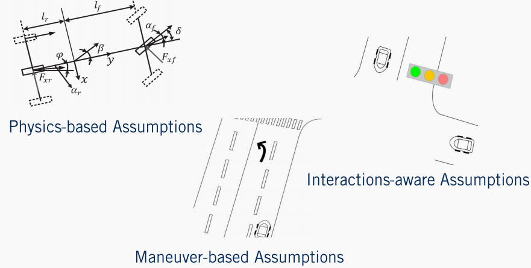

The first class of assumptions we rely on, is that vehicles must follow a set of physical constraints governing their movement. As we saw in course one when we were discussing Vehicle Kinematics and Dynamics. These very same vehicle dynamics can be applied to other vehicles in the environment to predict their motion. We refer to this type of prediction as a **physics-based prediction.** 

The second class of assumptions that can be used are that almost all motions by a vehicle on the road, are made up of a finite set of maneuvers in a restricted domain in the environment. In this case, we assume that vehicles which are on the road will stay on the road and follow the driving rules. For example, they will most likely stay in their lane unless indicating otherwise and stop at regulatory elements requiring stops. They are unlikely to drive over sidewalks or lawns or through obstacles. We refer to this type of assumption as **maneuver-based.** 

Finally, the third class makes the same assumptions as the maneuver-based assumptions. However, instead of only evaluating each vehicle independently, we can also incorporate the assumption that the dynamic objects will react and interact with each other. An example of this type of prediction, is during a merge by a vehicle into an adjacent lane. Often, the vehicle in the destination lane will slow down to make more room for the incoming vehicle to maintain a safe following distance. These types of assumptions are referred to as **interaction-aware assumptions.** 

#### 3.2 Pedestrians

For pedestrians, the same three categories can be used to summarize the assumptions we can make. In terms of physics-based assumptions, pedestrians tend to have a low top speed but can change their direction of motion and speed very quickly. This makes pedestrians quite challenging to predict reliably using purely physics-based assumptions, but the range of positions a pedestrian can reach in a short time frame is limited. For maneuver based assumptions, pedestrians tend not to interact directly with vehicles. As they primarily use sidewalks or other pedestrian exclusive zones when traveling. When entering the drivable areas of the environment such that they might come into contact with vehicles, they primarily use pedestrian crossings. 

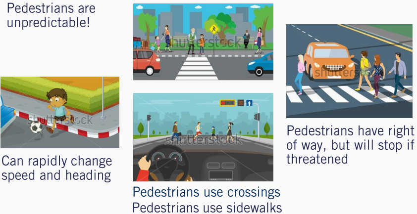

Although restricting pedestrian motion to these regions is a reasonable assumption, it is not a hard constraint and the unpredictability of pedestrians requires maintaining multiple possible hypotheses about their future actions. Finally, pedestrians ultimately have the right of way and it is the self-driving cars duty to stop when necessary. Inattentive pedestrians may wander into a roadway without warning, but will often stop when threatened by an oncoming vehicle. These types of interactive assumptions can also be incorporated into motion prediction for pedestrians. 

---

### 4. Constant Velocity Prediction Model

Now that we have a better understanding of motion prediction, let's have a look at a simple computationally efficient algorithm, that can be equally applied to both pedestrians and vehicles. 

This algorithm makes only one extreme assumption regarding the motion of the dynamic object. **All dynamic objects will maintain their current velocity both in terms of magnitude as well as heading.** Understanding this, let's now look at the algorithmic implementation of this simple constant velocity model. 

The algorithm takes three basic inputs $t$, the prediction horizon or the amount of time to predict the object's location into the future, $dt$ , the update rate or path simulation frequency, that is the amount of time between state predictions, and $x_{obj}$, the current object's state which includes the position and velocity of the dynamic object. This algorithm iterates from the current time zero until the end of the horizon $t$ in increments of $dt$ . As we saw in the trajectory rollout algorithm in the previous videos, updating the path with constant velocity model. The output of this algorithm is a list of predicted objects states, positions, and velocities for every time step in the prediction horizon. To see how well these predictions perform, let's look at a quick example. 

---

### 5. Constant Velocity Prediction Model - Example

We'll use a three second horizon with a one second update step and the current vehicles state as indicated by the red arrow in this figure. As expected, the predicted locations of the vehicle move in a constant direction with a fixed step size which corresponds very nicely with this straight line segment, with a constant speed limit. Simply put, this is because the constant velocity assumption is valid for this segment of roadway. 

Where the constant velocity estimate fails, however, is everywhere else. While this algorithm weakly falls into the category of physics-based assumptions, it fails to capture the full complexity of vehicle dynamics models, or even the ability of a vehicle to accelerate or decelerate or apply a steering command other than zero. Another large flaw of the constant velocity assumption, is that it fails to account for vehicles tendency to follow changes in the road shape. At every point in this curved roadway example, the constant velocity model predicts the path will continue into the oncoming lane. These predictions are wholly unsuited to behavior planning. 

Similarly, the constant velocity prediction fails to account for road signs to make velocity adjustments. Vehicles approaching stop signs tend to slow down and vehicles leaving a stop line tend to accelerate. The assumption which this algorithm makes is quite strong and does not apply for most cases that dynamic objects may be observed in. The key challenge to motion prediction is really to select the most likely inputs, to a vehicle or pedestrian model given what information is available. Nonetheless, the constant velocity model is an excellent starting point and helps define the concept of motion prediction clearly. It relies on a minimum of information about the dynamic object, to form its predictions and can be used wherever additional cues are completely unavailable. 

---

### 6. Summary

> - Identified motion prediction and its Importance 
> - Requirements for motion prediction
> - Assumption for Simplifying the problem in the case of 
>   - Vehicles
>   - Pedestrians
> - Simple Constant Velocity Prediction Model
> - Issues with Simple Constant Velocity Prediction Model

Let's summarize. In this lesson, we learned about the task of motion prediction for dynamic objects and its importance to autonomous driving. We then defined minimal and optional information requirements to create effective motion prediction algorithms for both vehicles and pedestrians. We then looked at a simple constant velocity algorithm for predicting the future location of objects and identified many of its limitations. In the next video, we will look at the methods to enhance our motion predictions, through the use of high-definition roadmaps. We'll see you then.

---

## Lesson 2: Map-Aware Motion Prediction

### Learning Objectives

> - Describing a set of assumptions made by map-aware algorithms to improve motion prediction
> - Define a lane follow method to improve positional prediction
>   - Identify strategies to handle multiple future lane choices
> - Determine methods for velocity modulation around regulatory elements
> - Identify issues and short-falls with the map-aware assumptions

Welcome to the second lesson in our module on Dynamic Object Interaction. **In this video, we will be extending the topic of motion prediction of dynamic objects, to include information available from the HD road map.** To begin, we will discuss the different assumptions relied on by map-aware where algorithms, for motion prediction, To keep the task simple and efficient. Then we will look at applying a lane following prediction approach, to improve position prediction components. Next, we'll explore map-based prediction when multiple lane options are available. Then we'll explore a velocity prediction around regulatory elements. Finally, we'll discuss some of the issues in short-falls of map-aware predictions that revolve around assumptions made regarding dynamic objects. So let's get started. 

---

### 1. Assumptions to Improve Prediction

In the previous video, we explored constant velocity motion prediction, which worked well only in a very limited number of scenarios. Map-aware algorithms make two broad categories of assumptions to improve the motion predictions particularly for vehicles. **Position-based assumptions to improve the position component of the vehicle state, and velocity-based assumptions to improve the velocity component.** 

The first assumption made to improve the position component of the prediction, is that vehicles driving down a given lane usually follow that lane. Returning to our simple example scenario, if we have a vehicle on a curved roadway, the vehicle will most likely turn along with the roadway. The second assumption that can be made is that a drive lane change or direction prediction, can be made based on the state of the indicator light of the vehicle. If such a detection has been made by the perception stack for a vehicle, it is possible to switch the prediction to account for this additional information. 

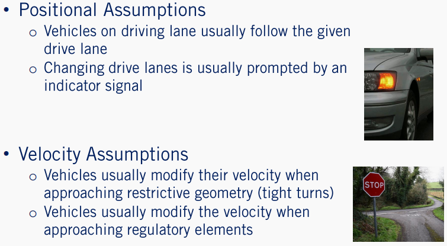

Velocity-based assumptions are used to improve the velocity prediction of a dynamic object. All vehicles on the road are affected by road geometry. Thus, it is useful to assume that as a vehicle approaches a turn with significant curvature, the vehicle is likely to slow down to avoid exceeding its lateral acceleration limits. Finally, velocity prediction can be greatly enhanced if we also consider a regulatory elements, which the dynamic object may encounter. For example, if there is a stop sign at a close distance in front of a dynamic object, it is safe to assume that the vehicle will execute a decelerate to stop maneuver, resulting in a lower velocity over time. 

Well this is not a complete set of all assumptions that can be made to improve motion prediction using HD road maps, they are sufficient to illustrate the diversity of contextual information available to improve our predictions. Further, it is important to understand that the more constraints or assumptions that are added to a prediction model, the less generalizable it can be to all traffic scenarios. In fact, by the end of this lesson, we will see cases where even these generic assumptions can be overly constraining. 

---

### 2. Improvement of Position Estimation

Let's now incorporate each of these map-based assumptions into our motion prediction methods. For roadways with natural curvature, we make the assumption that a vehicle which is on a drive lane will likely follow that drive lane through the curve. Our motion predictions can be updated then by using the center line of the mainland map as the predicted path of the vehicle, instead of the straight line path generated by constant velocity predictions. 

Recall the lane that map definition from module two of this course which provides left, and right lane boundaries for every lane on the road from which there can be a center line to construct it. **The center line of a lane lit is defined as a set of points making up a polyline that is equally spaced from both lane boundaries.** While minor deviations from the exact center line can be expected, the center line can act as a good motion prediction approximation. This is a major step forward over constant velocity predictions on any roadway with curvature. 

---

### 3. Improvement of Path Estimation

However, by restricting path predictions to the center line of any given lane lit, will result in two major issues. **The first is that during normal driving, drivers routinely change lanes.** So as mentioned earlier, such maneuver may be predicted based on indicator light perception. Although not all lean changes by human drivers are preceded by an indication. 

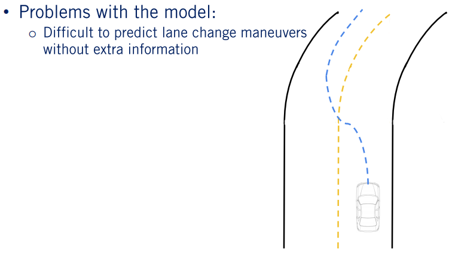

**The second problem that arises is that it is regularly the case, that there is more than one center line to choose from.** Such as in the case of an intersection. For example, at this simple T junction, it is possible for the vehicle to turn either left or right. 

> Solution with the model
>
> - Most likely prediction
> - Multi-hypothesis prediction

This leads us to the need to consider multiple hypotheses based on likely behaviors of the other agents in the scene. Again, we have two options: we can identify the most likely behavior using objects state, appearance, and track information, and then construct a prediction based on the most likely behavior, or we can construct a prediction for the most likely behaviors and associate a probability that the agents will follow a particular path based on the state appearance and track information. The second approach is a slight generalization of the first. So we will focus our attention on it. We refer to this as multi hypothesis prediction. 

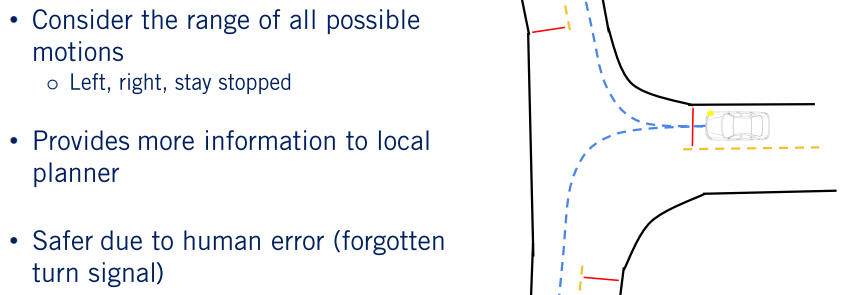

In the case of multi-hypothesis prediction approaches, each nominal behavior of a vehicle based on the full range of possibilities available to it at its current location in the HD road map is considered. For the three-way intersection example, we can include three possibilities: turn left, turn right, or stay stationary. Based on corroborating evidence such as indicators signals, position to the left or right of the center line, and the state of the vehicle at the intersection. It is possible to evaluate each of the three hypotheses in terms of the likelihood the agent will execute each of them within the prediction horizon. These probabilities can be hard to quantify exactly. So can either be learned from training data of many vehicles proceeding through similar intersections, or can be engineered and refined from real-world testing. 

Such approaches traditionally provide more ambiguous information to the behavior planner, requiring this next stage of the planning process, to consider multiple scenarios simultaneously, and to handle the probabilistic representation of belief. However, if handled correctly, this approach can also be significantly safer, enabling defensive driving strategies, and rapid re-planning if probabilities shift based on new information. This approach also has an advantage of being able to adapt to human-based driving errors. Such as forgetting to signal when changing lanes. 

---

### 4. Improvements to Velocity Prediction

Now that we understand how a road map can be used to improve the positional component of the predicted trajectories, let us now dive into the velocity component. **The first improvement in this area is based on the known road geometry or curvature, and the prediction of how other vehicles will react to it.** All vehicles no matter their making model, will reduce their velocity as they enter sharp curves or execute turns. We can use an expected maximum lateral acceleration, usually in the range of 0.5 to one meter per second squared, to improve velocity estimation along curves. 

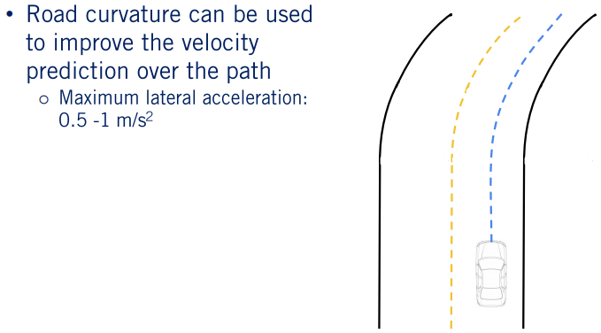

**The second and more significant improvement is to incorporate regulatory elements to improve velocity estimation.** Given the anticipated path of the vehicle, any roadway elements such as stop signs, yield signs, speed limit changes or traffic lights, can all inform the velocity prediction. In the case of traffic lights the lights state is also required. In each case a stop location can be predicted based on the regulatory element line, as defined in the road map. 

Then a smooth deceleration can be applied to the vehicle velocity prediction along its path. In fact, given a HD road map, it is possible to preprocess the map for nominal trajectories along each roadway, and to define lanelet specific multi-hypothesis priors, based on nominal driving behavior. This serves both as guidance for the ego vehicle in planning its behaviors and trajectories, and also in terms of refining the motion predictions for other agents. Of course obstructions in the lane ahead of a vehicle precedence of arrival information at intersections and lead vehicles in the lane, can all be integrated to improve predictions for other vehicles. Given the complexity of making decisions for a single self-driving car, there is a limit to how many variables and how much depth of information in logic can be used, to improve motion prediction. 

---

### 5. Issues with the Assumptions

> - Vehicles don't always stay within their lane or stop at regulatory elements
> - Vehicles off of the road map cannot be predicted using this method

There is also a limit to how much we can rely on assumptions about expected dynamic object behavior, to predict future actions. Dynamic objects do not always behave according to the nominal behaviors expected of the drivers. They do not exactly follow the center line, do not drive at the speed limit, accelerate and decelerate at different rates for example. Further, they may react to information not yet available to the prediction system, such as a potholes in the road ahead or a bouncing ball. They may simply not observe a regulatory element as occurs when a vehicle accidentally runs a red light. All these variations must be accounted for which can be done to some extent with the multi-hypothesis approach. The best approach is therefore to track the evolution of beliefs over the set of hypotheses, and to update based on evidence from the perception stack at every time step. There is a great deal of complexity embedded in these methods, and we encourage you to explore some of the challenging issues associated with motion prediction for self-driving cars, by digging into the references included in the supplementary materials. This concludes our discussion of motion prediction. 

---

### 6. Summary

> - Described a set of **assumptions** made by map-aware algorithms to improve motion prediction
> - Defined position-based and velocity-based prediction enhancements
>   - Identify strategies to generated multiple hypotheses
> - Identified issues with the map-aware assumptions

In today's lesson, we have described a set of assumptions for map-aware algorithms, to improve motion prediction of vehicles on drive lanes, defined position and velocity-based methods to improve motion prediction, described multi-hypothesis prediction as a way to maintain multiple beliefs about another vehicles future actions, and finally identified some of the issues with exclusively relying on map-aware motion prediction. I hope you will join us next time where we will see how to use our predicted paths, to calculate a time to collision, between pairs of dynamic objects. See you there.

---

## 第三课: 碰撞时间

### 学习目标

> - 定义 **碰撞时间** 的概念
> - 明确计算碰撞时间的两种方法并讨论他们的优缺点
>   - **仿真方法**
>   - **估计方法**
> - 概述基于仿真计算碰撞时间的算法

欢迎来到第三节也是本周的最后一节课。在这节课中我们将会去看动态物体之间碰撞时间的定义。我们将会展示两种计算碰撞事件的方法：分别是基于仿真的方法和基于估计的方法。然后对比两种方法各自的优缺点并指出每种方法的适用场景，最后详细探索了基于仿真的方法并计算任意两个物体之间的碰撞事件。让我们开始吧。

---

### 1. 碰撞时间的定义

碰撞时间对于自动驾驶车辆来说提供了一个很有价值的**行为安全性**度量，并被广泛的用来评估在当前环境中的可能机动操作。通过知道碰撞即将发生以及何时于何物体上发生，自动驾驶系统可以规划出更加安全的机动性操作，或者准备规避紧急情况的操作。**为了评估动态物体之间的碰撞事件，我们采用预测轨迹来计算可能碰撞点。**如果存在碰撞点，碰撞时间就是碰撞发生的时间。

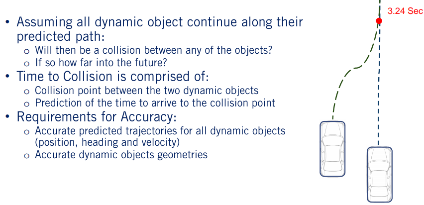

计算碰撞时间可以分两步来完成。第一步，我们需要计算两个物体在预测轨迹上碰撞点的位置，第二步，如果碰撞点存在，我们需要计算动态物体需要花费多少时间到达。**计算碰撞时间的难点在于它过多的依赖于物体即将到达的环境的精确认知来进行精确的估计。**很明显，对于物体精确的预测对于确定他们之间的碰撞点发生时间至关重要。然而精确的运动预测如前两节描述的那样是很难的。 

与此同时，我们还需要**所有动态物体精确的几何形状。**这是因为在计算精确的碰撞点的时候需要得到两个物体精确的几何形状。环境中的所有物体都是被从前视或者后视的角度观察到，因此在行车过程中很难得到他们精确的几何形状。由于上述两方面所带来的误差计算碰撞时间一直被看作是一个定期更新的估计问题，同时在做决策规划的时候需要考虑一定的安全余量。

---

### 2. 计算碰撞时间的方法

计算碰撞时间有两种主要的方法。分别是基于仿真的方法和基于估计的方法。 

**基于仿真的方法**

基于仿真的方法通过仿真当前场景下每一辆车在未来有段时间段内的运动。在每一个仿真时间步长，计算新的位置，朝向以及所占的空间。这是通过递推之前给出来的预测轨迹实现的。 

一旦所有运动物体在未来一段时间段内的位置得到之后，就会检测是否任意两个物体之间会发生碰撞。如果他们会发生碰撞，碰撞的位置和时间点将会被记录下来。需要注意的是这个碰撞检测和静态情况下的碰撞检测不同，因为整个路径上的位置都会被与静态物体比较。因为这些碰撞检测在两个运动物体之间进行，我们只需要检测两个物体在每一个时间的几何形状是否会相碰，在新的时刻物体们会占据新的空间。

**基于估计的方法**

基于估计的方法通过计算物体几何形状在预测路径上的演化来计算碰撞时间。计算的结果便是可以得到一条线来对比进行潜在碰撞的计算。一旦这条线被计算出来他们之间的交点将会被用来计算潜在的碰撞点，即两个或多个动态物体是否会同时出现在某一个位置。 

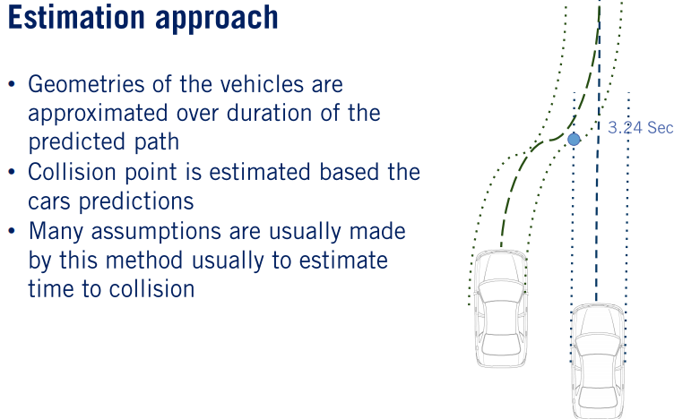

如果这样正确的话，那么潜在的标记点将会被记录下来，每一个车辆到达碰撞点的时间将会被用来估计碰撞时间。**这种方法同样做了很多种简化的假设来加速计算时间。**这些基本假设包括：采用物体路径交点来确定碰撞点，采用边界盒子来作为物体占用空间的度量，以及采用匀速运动模型来估计到达碰撞点的时间。

---

### 3. 相对优点和缺点

每一种方向相对于另外一种方法都有自己的优点和缺点。基于估计的方法依靠简化的假设大大减少了计算时间的消耗。基于仿真的方法计算时间消耗很大，因为它包括一步步的评价是否碰撞，障碍物几何形状的计算。由于简化假设的存在，基于估计的方法对于碰撞点和碰撞时间的估计精确度较差。

基于仿真的方法与之相反不依赖于这些简化的假设，由于步长较小，可以得到高可信度的碰撞时间估计。这些差异使得两种方法分别适用于不同的场景。对于高实时性的车载计算场景，基于估计的方法更加适用。相反，离线场景比如数据集生成，基于仿真的测试等精确性至关重要，因此基于仿真的方法更为适用。 

---

### 4. 仿真方法伪代码

接下来我们来看一个详细的基于仿真方法来计算碰撞点和碰撞时间的例子。基于估计的方法不在本节课讨论的范围内，但是我们在附加材料里面提供了基于估计的方法的资料链接。 

>- C. Urmson, C. Baker, J. Dolan, P. Rybski, B. Salesky, W. Whittaker, D. Ferguson, and M. Darms, “[Autonomous Driving in Traffic: Boss and the Urban Challenge](https://www.aaai.org/ojs/index.php/aimagazine/article/view/2238),” AI Magazine, vol. 30, no. 2, p. 17, 2009. 这篇文章给出了在 DARPA Urban Challenge 里面处理障碍物的方法的概述。

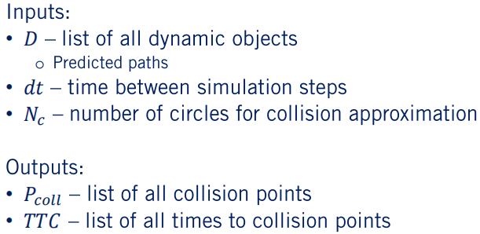

这个算法的输入包括一系列带有预测轨迹的动态物体以及带有规划轨迹的本车。仿真预测时间间隔 $dt$ 以及任何在碰撞检测函数中需要用到的参数。多边形相交检测需要物体的轨迹点，圆形相交检测需要圆形的数量以及他们相对于物体位置的间隔。**本算法的输出是碰撞点以及包含碰撞点的两个物体的碰撞时间。**需要注意的是为了提升碰撞检测的精确性仿真时间间隔可以和之前预测的时间间隔不同。 

这个算法按照仿真时间步长从当前时间迭代到仿真时域的终点，不能超过预测轨迹和规划轨迹长度的最大值。在每一步我们把动态物体的位置按照运动预测的结果往前递推一步。每一步所有物体的状态，位置，朝向以及速度都会被估计出来。然后对于每两个物体之间我们执行碰撞检测。如果碰撞点存在，那么当前的时间就会被作为碰撞时间绑定到此碰撞点上。

---

### 5. 动态物体状态的估计

我们接下来把仿真方法的每一步都做一个深入的探讨。对于状态预测，我们必须考虑预测预测路径时间步长和仿真时间步长的不一致。

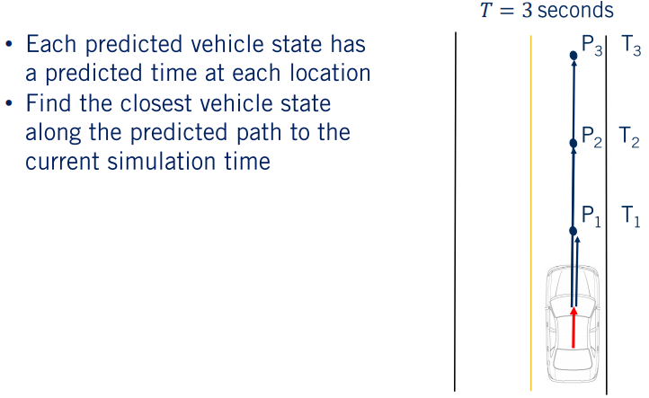

因此我们必须要获得在仿真时间点上给定动态物体位置的最好估计。我们找到当前仿真时间前方最近的预测时间点，要么遍历整个预测路径，要么在仿真过程跟踪当前预测路径的参考状态。然后我们把下一个时间区间内预测路径的位置作为仿真时间点的位置。 

对于两个物体之间的碰撞检测，我们可以精确的计算也可以近似计算。对于每一种情况我们对比两个物体的时候对他们做了近似使得不依赖于占用空间格子的信息。对于精确计算的方法，我们采用多边形近似，检测到有重叠的情况即为碰撞点。对于圆形近似方法，两个圆形几何进行对比，三个圆形近似的场景只需要计算九个距离信息，四个圆形近似的场景需要计算16个距离信息。 

需要注意的是随着物体数目的增加，如果需要遍历计算每一种碰撞情形的话，碰撞检测的数量极速上升。当然可以只计算本车和其他车辆之间的碰撞情况，这样的话问题将会变成线性复杂度，或者可以通过中心点之间的距离信息大幅度的消除很大一部分情况。如果两个物体的距离不在两倍彼此尺度范围内的话，我们将不会考虑两者之间的碰撞检测。 

一旦检测到碰撞，可以通过计算确定碰撞点的信息。如果我们假设时间步长很小，那么这个碰撞点将会满足两个物体的圆的方程。通过推导可以得到x和y的方程。x坐标等于I圆的圆心x坐标乘以J圆的半径加上J圆的圆心x坐标乘以I圆的半径。然后除以两者的半径之和。对于y坐标的计算同理。同理也可以计算两个圆之间相交的情形，这种情况下将会有两个点，计算方法在附加资料中给出。 

通常情况下，会在碰撞时间精确性和计算时间消耗之间选取一个折衷。增加计算结果可靠性的同时会带来计算时间的增加。就像我们举的这个例子一样，如果把圆形的数目减小到1，时间消耗会显著降低，但是计算结果的精确性也会大大的降低。现在你应该对于碰撞时间的计算以及近似预测结果中的应用有了一个很好的掌握。

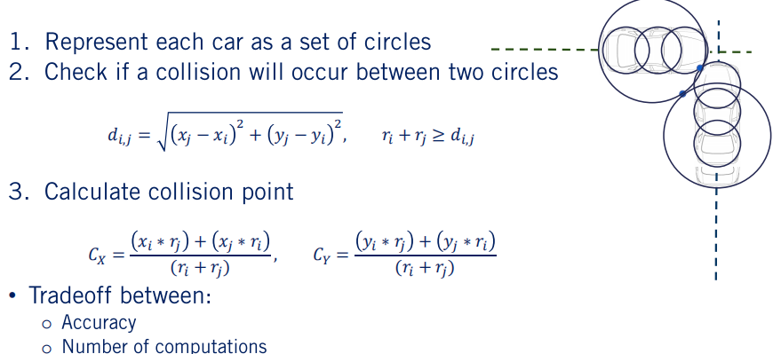

 

---

###  6. 总结

> - 定义碰撞时间以及它的组成
> - 确定两种计算碰撞时间的方法以及各自的优缺点
>   - 基于仿真的方法
>   - 基于估计的方法
> - 基于仿真的方法计算碰撞时间的概述

在本节中我们首先定义了碰撞时间的概念。之后讨论了两种计算碰撞时间的方法各自的优缺点。最后详细的展示了基于仿真的方法计算碰撞时间的步骤。 

祝贺你。你已经完成了动态物体交互的课程。在本节课中你学会了如何采用匀速运动模型预测动态物体的运动，之后依赖hdmap的信息改进了运动预测的方法，然后把动态物体的运动预测应用到计算碰撞时间的任务中。我们将会在下一节课见到，下一节课我们将会探讨行为决策的内容，对于每一种碰到的场景选择合适的机动操作的决策器。下节课再见。
