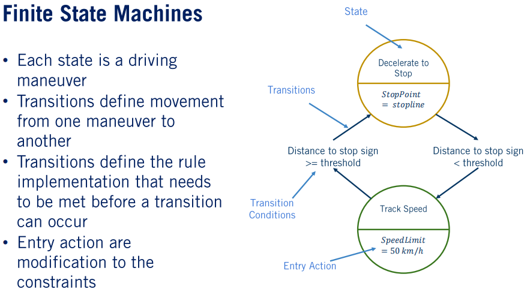
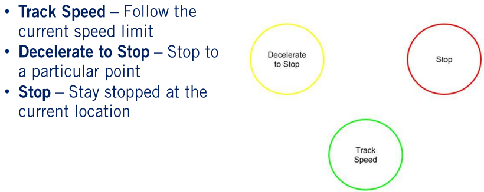
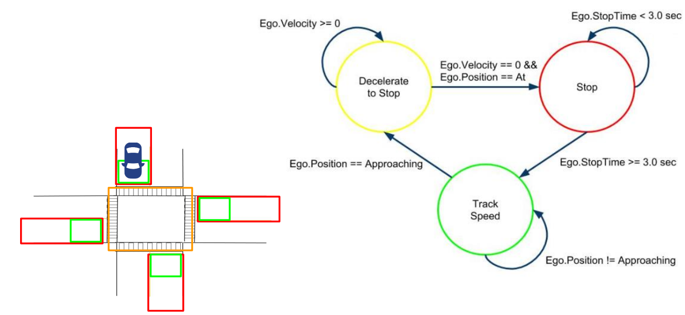
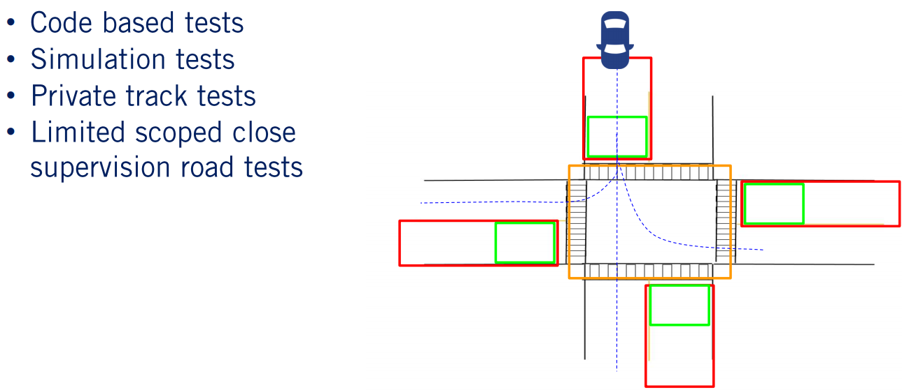
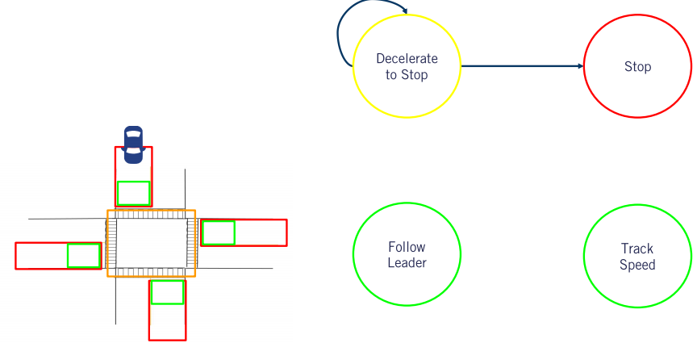
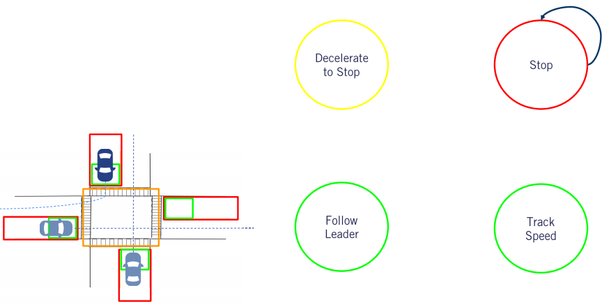
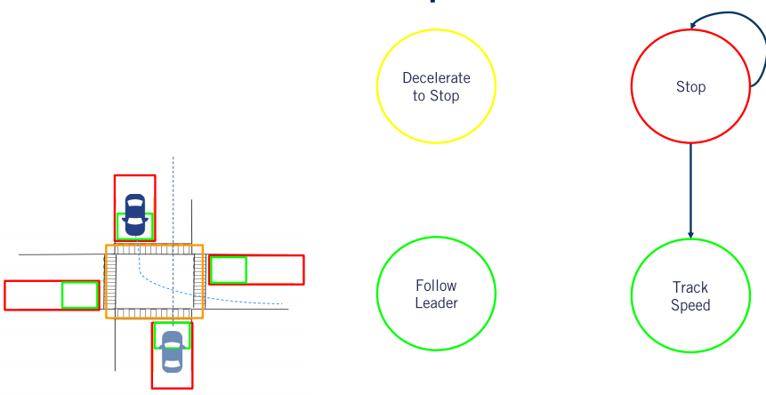
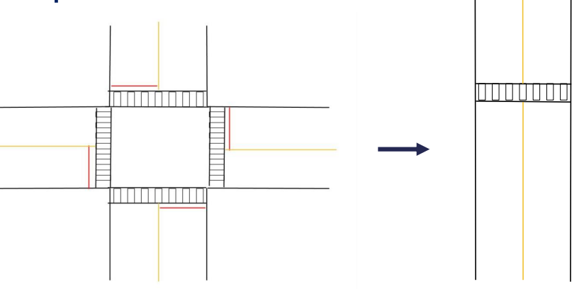
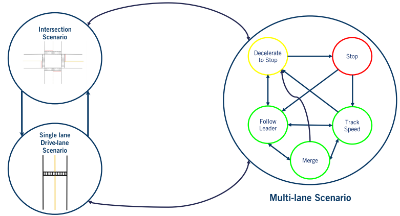
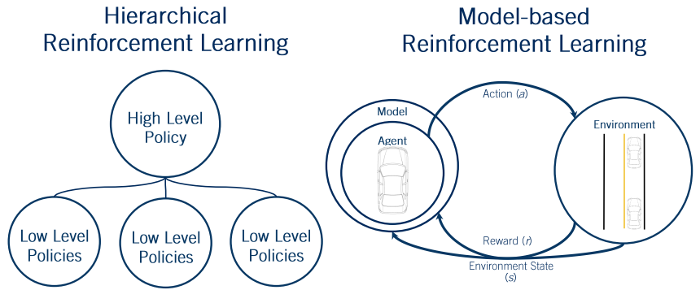

# 第五课: 行为规划理论

本节课搭建了一个基本的基于规则的行为规划系统，可以实现例如换道，通过停止车辆以及通过路口场景下的上层驾驶行为决策。本节课定义了一个规则集，通过指标选择可行的驾驶行为，用来在下层的路径规划过程中限制路径和速度在一定范围内。

## 学习目标

- 回忆行为规划在自动驾驶系统中的角色以及输入和输出。
- 采用状态机来实现行为规划，同时明确其优点和缺点。
- 明确特定场景所需要的驾驶行为。
- 理解规则引擎在行为规划中的优点和缺点。
- 理解强化学习在行为规划中的优点和缺点

---

## 第一节: 行为规划

### 学习目标

> - 行为规划系统的定义。
> - 理解行为规划器的标准输入和输出。
> - 理解与行为规划有关的状态机。

欢迎来到运动规划课程的第五周。在本节课我们将会开始讨论运动规划系统架构中非常重要的一部分，即行为规划。首先我们将会介绍行为规划的定义以及如何采用状态机建立一个行为规划器。然后在本节课之余我们将会介绍如何实现基于状态机的行为规划器以及用它来处理不同的场景。最后我们将会探索其他可以解决行为规划问题的可选方案，并探讨它们的优点和缺点。 

在本节中，我们将会定义行为规划系统的需求，探索行为规划模块的典型输入和输出，最后介绍有限状态机的概念，以及怎么用它来建立一个行为规划系统。让我们开始吧。 

---

### 1. 行为规划

**行为规划系统负责在变化的驾驶环境中规划出可以安全完成任务的上层驾驶行为或者操作。** 规划机动操作应该考虑交通规则以及与路面上其他动态和静态障碍物之间的交互。 上层决策应该保证车辆能够在环境中安全有效的运动。 在第一课中我们已经讨论过很多这些基本概念了，正是行为规划能够作出正确的决策，使得我们可以安全的运动到目标点。

为了展示行为规划决策，我们假设自动驾驶车辆到达了一个非常繁忙的十字路口。行为规划器必须规划出什么时间，什么地点停下来，停止多长时间以及什么时候起步通过路口。行为规划器必须高效的完成此种行为决策，这样的话自动驾驶车辆就能够很快的对环境中的变化作出响应。行为规划器必须能够处理包含环境噪声的不准确信息以及由于感知误检所造成的错误信息。现在的我们已经有了行为规划的定义，接着我们来建立一个行为规划要处理的行为列表。在之前的课程中，我们已经描述了这些基本的机动操作们，本节课我们采纳它们作为自动驾驶车辆需要执行的机动操作或者驾驶行为。 

---

### 2. 驾驶行为

我们总共考虑五种驾驶行为。第一种是速度跟踪。这种模式在无约束的公开道路上行驶，前进过程中唯一需要考虑的约束是当前道路的限速。第二种是跟车模式。这种情况下 需要考虑前车的速度以及安全的跟车距离。第三种是减速停止。这种情况下在前车的规划范围内有一个停车点，前车应该减速停止在停车点上。每一种需要停止的场景都可以触发此种模式。第四种是本车当前是停止状态，然后需要保持停止一段时间。比如在停止标志前面，本车需要至少停留三秒。第五种是汇流行为。在这种情况下本车需要汇合到坐标或者右边的车道。 

这些基本的驾驶行为将会用来搭建我们的行为规划器。然而在实际场景中我们需要考虑更多的驾驶行为，因此行为规划器的复杂度也会随之上升。 

---

### 3. 行为规划器的输出

行为规划器主要的输出是在当前环境中可以执行的一个**驾驶行为。** **伴随驾驶行为，行为规划器也会输出一个用来限制局部规划问题的约束集合。** 在本节课中我们一直都需要使用的一个约束是从车辆当前位置到终点的路径，即车道中心线。

默认路径的速度限制。在正常驾驶情况下的当前道路边界。任何在当前道路前方需要停止的位置，仅在与之绑定的驾驶行为被触发才生效。局部路径规划最关心的动态物体集合。动态物体之所以关键是因为在预测未来路径的时候采用了近似的方法。 

---

### 4. 输入要求

为了行为规划器能够生成想要的输出结果，需要依赖自动驾驶全栈的其他模块传来的大量信息。首先行为规划器需要对车辆周围路网环境的全面认识。这些认知来自于高清度地图。其次行为规划器需要知道车辆到达目标点需要跟随的轨迹。这来自于道路网给出的全局路径。然后为了能够局部环境中车辆周围的定位高清地图元素，车辆本身的位置也是很重要的。定位系统需要给出精准的定位信息。最后为了完全理解安全完成任务所需要执行的操作，行为规划器需要所有相关的感知信息。这些信息包括环境中的所有动态物体，包括车辆，行人以及自行车。 

对于每一个动态物体，它当前时刻的状态，预测轨迹，碰撞点以及碰撞时间都是需要的。同时也包括静态物体，比如静止的车辆，施工标志，以及包含状态的红绿灯。最后需要一个网格化地图来表征可以执行机动操作的安全性区域。拥有了上述的所有信息，行为规划器需要选择出合适的驾驶行为以及必要的保证车辆安全有效到达目标点的约束。为此，我们将要建立一个规则的集合来显性或者隐形的包含道路上的所有规则以及与其他动态物体之间的交互。 

---

### 5. 有限状态机

一种通常被用来解决利用规则集合来选择驾驶行为的方法是有限状态机。在整节课中，我们将会一步一步的建立起基于有限状态机的行为规划器。我们也会讨论这种方法的局限性。为了更好的理解有限状态机的方法，我们考虑一个针对单一场景的状态机的简单例子，处理一个没有红绿灯的停止标志交互场景。 

组成有限状态机的第一部分是它的状态集合。**对于行为规划器，状态包括每一个可能遇到的的驾驶行为。“**在我们的例子中，我们只需要两种机动操作或者驾驶行为，速度跟踪和减速停止。行为规划器定义的机动决策是有有限状态机的状态来决定的。每一个状态都关联着一个输入机动操作，即要进入此状态之前需要执行的操作。对于我们的行为规划器，这些进入状态也包括设置伴随行为决策结果的必要约束。例如，一定我们进入减速停止状态，我们必须定义在当前路径上的停止点信息。同样的进入速度跟踪状态需要设置速度限制。

**有限状态机的第二组成部分是切换条件，其定义了从一个状态切换到另外一个状态的操作。**在我们的两状态例子中，我们可以从速度跟踪切换到减速停止，也可以从减速停止切回到速度跟踪。需要注意的是也可以从当前状态切换到当前状态，触发进入当前状态的操作。每一个切换操作伴随着从一个状态切换到另外一个状态的切换条件。这些切换条件在某一个状态一直被监视以确定合适需要进行切换操作。对于我们的简单例子，从速度跟踪切换到减速停止的条件包括检查在当前车道上的一定距离内是否存在停止点。类似的如果我们在停止点减速到0，我们可以从减速停止状态重新切换到速度跟踪状态。

这个两状态例子指出了基于有限状态机的行为规划器的重要方面。随着场景和驾驶行为数目的增加，有限状态机包含更过的状态和转换条件，同时也变得更加复杂。 

---

### 6. 有限状态机在行为规划决策中的优点

有限状态机是解决行为规划问题的一个简单高效的工具。我们可以把它看作是对于行为规划定义的一个很好的实现，包括定义机动操作或者状态，给局部规划的约束以及满足道路规则和安全的与道路上的动态和静态物体进行交互。**通过保持跟踪驾驶环境的当前机动操作和状态，我们只需要考虑当前状态的切出条件，大大的减少了在每一此迭代所需要检查的切换条件。**

作为把行为规划分解为一个个状态以及它们之间的切换规则的结果，每一个规则必须保证相对简单。这导致在实现过程中需要对驾驶行为进行明确的划分。然而，随着状态数目的增加，定义所有切换以及其切换条件的复杂度大大增加。也没有任何显式处理输入信息不确定性的措施。这些挑战意味着在我们进入level 5级别自动驾驶的时候，有限状态机方法将会陷入困境。但是一个很好的出发点是在限定区域内的自动驾驶系统，状态的数目是可控的。我们将会在接下来的章节中看到这些限制以及一些可替代的方法。对于行为规划的介绍到此结束。

---

### 7. 总结

> - 定义行为规划系统
> - 行为规划系统的标准输入和输出
> - 实现一个基于有限状态机的行为规划系统
>   - 采用有限状态机来解决行为规划问题的优点

在本节中，我们对行为规划问题做了一个明确的定义以及它在自动驾驶全栈系统中的角色。我们讨论了行为规划模块的标准输入和输出。接着我们介绍了有限状态机及其组成部分并将其应用到一个两状态的行为规划问题中。从现在开始我们将会为有限状态机行为决策器增加更多的内容。在下一节中，我们将会学些如何在存在动态物体的交叉路口处理各种规则。下节见。

---

## 第二节: 处理不存在动态物体的交叉路口场景

### 学习目标

> - 明确我们需要考虑的交叉路口场景
> - 讨论我们需要用到的离散化环境
> - 检查需要完成这个场景的状态
> - 建立安全高效完成场景的状态切换以及状态输出
> - 强调实现正确且精确系统的测试步骤

在上一节中，我们介绍了行为规划器的概念，描述了实现行为规划的有限状态机的基本内容。在本节中，我们将会学习如何建立一个可以处理完整交叉路口场景的系统。我们首先会定义我们需要处理的场景。然后我们将会讨论如何离散化交叉路口地图来建立状态之间的明确转换关系。接着我们定义可以安全高效完成这个场景的状态以及他们之间的转换。最后我们种种强调了安全精确的实现我们的系统所需要的测试步骤。我们开始吧。 

---

### 1. 场景评估以及离散化交叉路口

我们要去处理的场景是一个四路的交叉路口。在每一个方向由两条车道和停止标志。交叉路口如图琐事，红线代表车辆需要停止的停止线。 

在本节末，我们将会能够在这个交叉路口执行左转，右转和直行的操作。我们在本节中不考虑在本场景中的动态物体，在下节中再把它们加入进来。我们现在定义了一个限定区域内的操作集合来供行为规划器处理。现在开始实现这个行为规划器。我们以如何离散化这个交叉路口开始，这样能够简化我们在环境中的决策。 

车辆需要开始安全减速靠近的区域称为交叉路口的接近区域，用红色表示。车辆必须停止等待起步的区域称为交叉路口的到达区域，用绿色表示。最后车辆通过交叉路口的区域称之为交叉路口的中间区域，用橙色表示。每一个区域的大小根据两个主要的因素动态调整：本车速度，在高速的时候我们需要更远的距离来安全舒适的停车，以及交叉路口的大小，交叉路口越大，每一个区域也越大。 

---

### 2. 状态机的状态

为了处理这种场景，我们需要三种上层驾驶行为。速度跟踪，这种机动操作只被当前道路上的限速所约束。一般来说，这是在进入交叉路口的任意一个区域所存在的状态或者安全到达交叉路口中间区域之后。状态进入操作设置了当前的速度限制。减速停止状态，这个机动操作使得车辆必须在到达停车点的时候减速到0。状态的进入操作定义了定制店的位置。停止状态，这个机动操作告诉车辆需要在当前位置保持停止状态。 

这个进入操作启动了一个计时器来设置车辆在起步通过路口之前所需要等待的时间。我们现在将会来讨论车辆在交叉路口可能遇到的各种场景，以及梳理出有限状态机的元素来正确求解行为规划问题。 

---

### 3. 状态机切换操作

我们从本车进入交叉路口之前开始，此时需要考虑的唯一约束是跟踪道路上的最高限速。这个限速约束在跟踪速度状态的进入操作里面设置。当本车进入交叉路口的接近区域，即红色区域的时候，它需要减速停止到停止标志附近，因此开始切换到减速停止状态。因此从速度跟踪状态到减速停止状态的切换条件是进入接近区域。

然后，一旦减速，自动驾驶车辆需要进入的下一个机动操作就是稳稳的停止在停止线，或者交叉路口的到达区域。为了达到这个目标，车辆必须保持在减速停止状态直到速度减到零同时进入到达区域。

减速停止状态的进入操作是安全停车点的设置。

由于这个场景的简单性，给予局部规划的停止点只有一个高清地图上的停止线。这在下一节存在动态物体与本车的交互的时候会变得更加复杂。 

一旦完全停止，本车将会切换到停止状态。作为进入条件，会启动一个计时器来保证本车在起步进入其他规则之前会在停止状态保留至少3秒。一旦计时器完成，规划器将会切换到速度跟踪状态，跟踪任务规划器给出的全局路径通过路口，左转，直行或者右转。这是采用有限状态机通过这个简单的四路交叉路口所需要的全部计算。通过这个过程可以看出，懂得人类如何分析这个场景，以及设计的行为规划器有什么特定功能是至关重要的。这些需要在操作区域设计中给出，我们需要保证设计出一个可以处理在给定场景中出现的每一个情况的完整状态机。 

---

### 4. 环境噪声的应对

一个对状态机的效果影响非常大的问题是输入的噪声。上面的状态切换条件是很准确的，并且依赖于本车能够到达停车点，并减速到零。即使没有其他动态物体，车辆位置可能包含噪声使得这些条件不能准确的满足。 

为了处理这种类型的输入噪声，我们引入了噪声阈值**超参数**.这是一个很小的阈值使得速度在接近零的时候可以认为是停止的状态。我们在后面的章节中会看到更多的**超参数**来处理存在动态物体的更多复杂场景。 

---

### 5. 行为规划测试

现在我们已经完成了有限状态机的建立，那么我们需要怎么测试它可以工作。一般情况下有**四个确定所设计的行为规划系统功能性的测试步骤**，依照我们在第一课中所讨论的自动驾驶全栈系统评估准则。首先需要进行代码的单元测试，保证代码逻辑的正确性。例如代码单元测试可以告诉编程者是否在高清地图里面的速度限制可以称为有限状态机生成的速度限制。然而这些检查不能确定是否状态切换操作是正确的，以及这些状态是否可以处理在给定环境中的所有场景。 

对此我们需要检查代码是否能够按照设想正确的处理所有的情况。然后我们来到仿真测试，在类似与Carla这样的仿真环境中运行，状态机在设计去处理的场景中运行。这种类型的测试可以确定状态机的转换操作以及状态覆盖是否正确。仿真测试的数目需要能够代表在当前驾驶环境中碰到的所有场景以覆盖程序员可能漏掉的特例。很多情况下需要选择一个具有代表性的测试集合，尤其是在场景的复杂性增加的情况下。

接下来是深度测试，一旦我们确认我们的有限状态机在仿真环境下能够按照设想中的运行。这种类型的测试测试在仿真环境下很难准确确定的场景，比如参数调试以及在真实环境中的感知噪声和误差。最后我们进行上路验证测试，由于之前的所欲测试都是在一个高度受控的环境中进行，路测具有高度的不可预测性，同时经常会导致系统在工程师没有考虑到的场景下失效。因此新的验证测试需要在前面环节的测试中加入。

---

### 6. 总结

> - 基于状态机的行为规划器处理的交叉路口场景
> - 确定将要使用的离散化环境模型
> - 检查需要完整这个场景的状态
> - 建立状态之间的切换操作以及安全高效的完成这个场景所需要的状态输出
> - 强调实现一个正确且准确的系统所需要的测试步骤

让我们回顾一下我们在本节中学到的东西。首先我们定义了这个场景以及需要处理的操作域。一个在所有方向都存在停止标志的交叉路口场景。我们然后讨论了交叉路口如何离散化能够使得我们能够进行不同状态之间的切换。接着我们建立起了状态之间的切换操作来定义在整个交叉路口需要定义的驾驶行为。最后我们检查了如何确定我们在交叉路口所执行的驾驶行为是否合适所需要的四个测试步骤。在下一节中我们将会展示如何处理存在动态物体的同样场景。正如我们看到的那样，这将会使得我们的状态机变得更加复杂和有趣。随后见。

---

## 第三节: 处理存在动态物体的交叉路口场景

### 学习目标

> - 回顾存在动态物体的交叉路口
> - 在上一节的状态机中加入动态物体
> - 建立起处理动态物体的时候的复杂性和特例的理解

Welcome to the third video this week on behavior planning. In the last video, we developed a basic behavior planner using a finite state machine for a four-way intersection without traffic. We now focus on incorporating traffic interactions in the same four-way intersection. In today's lesson, we will begin by reviewing some of the interactions with the dynamic object covered in previous modules, which we use throughout this lesson to safely interact with the other objects in the environment. We will then extend the state machine that we had built in the previous lesson to include these interactions with other vehicles. Finally, we will briefly discuss the many edge cases and various complexities that occur when dealing with dynamic objects. Let's dive in. 

---

### 1. 回顾 - 场景评估以及离散化交叉路口

Once again, the scenario we study in this video is a single lane four-way stop intersection. We would like to be able to travel in any possible direction through this intersection, while now handling interaction with other vehicles. 

Recall that in the previous lesson, we broke up the intersection into three areas or zones. The approaching zone highlighted in red, represents when a vehicle should decelerate to stop at the intersection. 

The ad zone highlighted in green, is where the vehicle should stop prior to entering the intersection. The on zone in orange, which represents the intersection itself. The zone's size can be shifted based on the ego and dynamic velocities, as well as the size of the intersection. 

---

### 2. 回顾 - 存在动态物体的交叉路口

Throughout this lesson, we will be focusing on the interactions with other dynamic objects, specifically other vehicles. In order to be able to safely deal with these vehicles, one important aspect is a measurement of the distance to various interaction points with the other objects. 

The first distance measure to consider, is the distance to dynamic objects. This is defined as the Euclidean distance between the current ego position to the center of any dynamic object in the environment. The second is the distance to collision point, which is the distance to a potential collision point with another dynamic object. Finally, the time to collision is the time it would take to reach the given collision point. Our approach to calculating this was discussed in the previous video. 

---

### 3. 状态机的状态

Now let's expand a finite state machine to accommodate the added complexity of the dynamic objects. We will need to increase the required maneuvers to four in order to correctly handle all interactions with vehicles in this scenario. 

First, let's review the maneuvers we included in our first version of the finite state machine. These were: track speed, who's only constraint is the speed of the given road, decelerate to stop, which requires the ego vehicle to decelerate to a stop point at a specific location in the environment, and stop, where we remained in the stop position. The new maneuver we need to add is follow leader. This maneuver state requires the ego vehicle to follow the speed of and maintain a safe distance to a lead vehicle, which is any vehicle directly in front of it in its lane. The safe distance is speed dependent and both safe speed and safe distance are updated as entry actions on every iteration of the behavior planner. 

Now that we have all of the states defined for our expanded finite state machine, we turn to populating the transitions. We will do this in a similar fashion to the previous lesson, starting at a given state and then identifying all of the transitions out of that state before proceeding to the next. We'll display progress through the intersection as we define transitions in a pictorial representation of the scenario seen here on the left, and we'll build up the finite state machine on the right. 

#### 速度跟踪

In each pictorial representation, the autonomous ego vehicle will be denoted by a red arrow. We will then start as we did in the previous lesson with the ego vehicle being located outside the intersection in the track speeds state. Much as we've seen in the previous lesson, the ego vehicle will only move to the decelerate to stop state once in the approaching zone. However, there is an additional concern, the situation in which another vehicle appears or enters the lane in front of the ego vehicle. In this case, we will move to attempt to follow the vehicle by performing a follow check. 

The follow check can be decomposed into two elements. A distance check and a same lane check. The distance check confirms that the vehicle is close enough such that it should be followed. In the same lane check confirms that the vehicle is actually in the same lane as the ego vehicle. In this case, we can use distance to dynamic object, which is the Euclidean distance to the object and compare that to a threshold. There are several methods which can be employed to check if the vehicle is in the same lane as the ego vehicle. However for simplicity, we will check if the lead vehicle is within the lane limits and if the heading of the dynamic object is within a given threshold to that of the ego vehicle indicating it is moving in the same direction. 

#### 跟前车行驶

In the follow leaders state, we define only two transitions. First, the lead vehicle might exit the lean before the ego vehicle is approaching or at the intersection, resulting in a switch to the track speed state. Or the lead vehicle drives out of the current lane, usually, onto the intersection when the ego vehicle is already in the at or approaching zones, resulting in a direct transition to the decelerate to stop state. 

We add the transition condition, that the distance to collision is greater than the distance to the stop point when the ego vehicle is either in the approach or add zones. In this situation, the ego vehicles should transition to decelerate to stop and set the stop point to the correct location at the stop line of the intersection. 

#### 减速停止

As before, in the decelerate to stop state, the ego vehicle continues decelerating until the time when it comes to a stop at the stop line. Which will result in a switch to the stop state as seen in our previous lesson. 

However, we once again have to take into account that a vehicle is able to pull in front of the autonomous car at an intersection, either from a driveway or an overtaking maneuver. Much as before, we perform the follow check throughout the decelerate to stop state when the ego vehicle is in the approaching or add zones, and transition to follow leader if the check returns true. In this case however, the distance check considers whether the lead vehicle distance to collision is less than the stop point distance, so that the leader following modes should take precedence. 

#### 停车

Finally, to complete our expansion of the finite state machine, let's look at the situations we can face once stopped. To keep things simple, we'll assume a very conservative driving style, where our autonomous car waits until all vehicles have cleared the approaching, at, or on intersections zones before proceeding through it. We leave the implementation of precedents at the stop sign for you to explore on your own. 

Further, we'll define simple checks for a rectilinear intersections, that identify all vehicles direction of travel with four easy labels and only consider other vehicles moving straight through the intersection. Relative to the ego vehicles body frame, a vehicle object with a relative heading of between minus 45 and 45 degrees, will be labeled as going in the same direction as the ego vehicle. 

A vehicle between minus 45 and 135 degrees relative heading, will be labeled as heading to the right. Between minus 135 and 135 as heading towards the ego vehicle and finally, between 45-135 degrees relative heading, will be labeled as going to the left. This simplification can be improved using predicted paths for the dynamic objects, especially if additional perception information is available to improve prediction of the direction of travel through the intersection. We can now define the transitions out of the stop state. Will have two sets of transitions. Either follow leader or track speed, depending on whether a vehicle is present within the lane through the intersection that satisfies the follow check. 

In each case, the transition conditions change based on the path through the intersection required by our mission plan. When the ego vehicle needs to turn left, any vehicle approaching from the left, right, or any oncoming vehicle, must clear the on intersection zone before the ego vehicle can proceed. When the ego vehicle needs to go straight, only vehicles approaching from the left or right, need to clear the intersection. 

Finally, when the ego vehicle needs to turn right, only vehicles approaching from the left need to clear the intersection. From this simple definition of the transitions out of the stop state, we hope you can visualize the additional checks needed to handle the precedence due to arrival order at an intersection and the possibility that the other vehicles might also turn left or right. 

---

### 4. 状态机切换操作

The resulting full state machine includes the following states and transitions. 

While this state machine is unable to be used on a real autonomous vehicle due to the oversimplifications we relied on, it serves as a good demonstration of the process of converting a given operational design domain into a functional finite state machine. You're now ready to start tackling more complex scenarios with more complete dynamic object models. 

---

### 5. 动态物体不能处理的特例

So far throughout the creation of a state machine, we have made one particularly **strong assumption** about how dynamic objects behave. Namely, that all dynamic objects obey the rules of the road. However, this is not always the case, and this difficulty leads to many edge cases that also need to be considered. 

Let's quickly discuss a few examples of what can go wrong with this strong assumption. The first example would be when a driver unintentionally swerves into oncoming traffic, entering the lane of the ego vehicle. This actually happened to a Waymo van in 2018, when a driver careened over a median into oncoming traffic. Another example, is of an aggressive driver racing through an intersection even as the ego vehicle has begun driving through it. Another common example, is when a vehicle fails to stop at the intersection. 

Finally, I will end with the case of a vehicle which is parked in close proximity to the intersection. If this vehicle is not tagged as parked, so that it might be treated as a static instead of dynamic object, our behavior planner may get stuck in a deadlock state waiting for this parked vehicle to move. This is by no means a complete set of all possibilities, and one of the primary objectives of behaviors safety assessment and testing, is to uncover as many variations of unexpected behaviors as possible, so that they also can be detected, categorized, and incorporated into the behavior planning design process. 

Just simply uncovering edge cases is not enough, however. Rather we must define how the autonomous vehicles should react to every one of these cases. For this emergency maneuvers such as a swerve or a hard break are required, with many more transitions and conditions to define. This is an active area of research and development and we've included some additional resources in the supplemental materials, if you'd like to find out more. 

---

### 6. 总结

> - Build upon the previous lesson to include dynamic objects as part of the state machine
> - Developing an understanding of the complexities and edge cases when dealing with dynamic objects

In summary, in today's video, we learned how we can create a finite state machine, able to interact with dynamic objects which follow the rules of the road. We saw why dealing with dynamic objects is so challenging by looking at just a few of the many possible edge cases which they can create. In our next lesson, we will see how we can continue building our behavior planner to be able to handle multiple scenarios simultaneously. We'll see you next time.

---

## 第四节: 处理多种场景

### 学习目标

> - Develop a larger overarching state machine which includes multiple scenarios
> - Develop a method to switch between driving scenarios

Welcome to the fourth video in the behavior planning module. In the last video, we introduced dynamic objects into our finite state machine behavior planner. In this video, we will develop a larger behavior planner which is able to manage the decision process for multiple scenarios simultaneously. We will do this by introducing the notion of a hierarchical finite state machine. We will also develop a method to switch between each of the driving scenarios as they occur. Let's begin. 

---

### 1. 目前已覆盖场景以及多种场景

So far in this module, we have developed a finite state machine behavior planner that can handle a single four-way stop intersection scenario with dynamic objects. 

However, in driving, there are many such scenarios which will be encountered. For example, there are three-way stop intersections, traffic light controlled intersections, and straight road scenarios, just to name a few. 

While many of these scenarios share some similarities largely due to the logic required to handle them, each of the scenarios can be considered to require fundamentally different driving behaviors. 

---

### 2. 单一状态机

One method of handling these multiple scenarios is by adding additional states, transitions and conditions to a single state machine in an ever-expanding network of behaviors. However, there are several problems with this approach. The first problem is that we would need to develop additional logic to differentiate the current scenario, as well as the rules needed to handle each scenario individually. 

This quickly runs into a problem known as rule explosion, in which the number of rules required to add additional scenarios becomes unimaginably large. The second problem with a single state machine is that due to the number of extra rules and transitions that need to be evaluated at each step, the computational time required significantly increases, and lastly, such a system is complicated to create and maintain as a number of cases which one must worry about increases quickly. Essentially, as the complexity increases, we lose all the advantages of using a finite state machine that were highlighted back in lesson one. 

---

### 3. 多个状态机

There is however, another approach we can use. We can represent each high level scenario as a single state. This would allow us to create much simpler transitions in between the high level scenario states. In this example, we can see that the states represent a straight road scenario and the four-way intersection scenario we worked with previously. 

With each one of these high level scenario states, we will store a low-level state machine with which we can handle the scenario independently. For example, for the intersection scenario, the low-level state machine will be the one constructed over the last two lessons. This method of representation is known as a hierarchical state machine, with the super-states representing each scenario, and the sub-states representing the maneuvers to be handled in each scenario. 

---

### 4. 分级状态机

The transitions between the high level scenario state machine would be a rule that defines when a new scenario has been entered, based on the HD roadmap and dynamic vehicle information. Let's say we have this simple hierarchical state machine with two scenarios, one for straight road with a pedestrian crossing, and another for a stop sign-based intersection. 

To move from the straight road to the stop sign intersection, the autonomous vehicle has to be close to an encounter with this intersection. This is done with a distance check to the next intersection along the mission plan. All the movements which we have talked about here is at the super-state level. The next question we have to answer is, how do we switch between scenarios when processing the sub-state maneuvers? 

---

### 5. 进入和切换条件-交叉路口

One method is to introduce transitions to key maneuver sub-states out of the current scenario super-state. Let us continue to use the intersection scenario as an example. First, let's establish which state will be the key exit state out of the scenario. The only way we're able to exit an intersection is while in the track speed or follow leader states after having passed the intersection. So let's put the exit transitions there. 

The condition on the transitions would be to confirm that this scenario has indeed been completed. In this example, we can use the distance to the next stop sign intersection. If this is larger than a given threshold, we can exit the intersection scenario. With this method of transition, we were able to also maintain maneuvers between scenario switches. In this case, track speed in the intersection super-state will connect to the track speed of the next scenario that we enter. 

---

### 6. 分级状态机-优势和劣势

Adding an additional multi-lane scenario to this hierarchical state machine is done by creating a new super-state scenario node, with a sub-state state machine capable of handling that scenario. 

This type of finite state machine has some inherent strengths and weaknesses. The strengths of this approach are due to it's subdivided nature. By creating individual state machines within each super-state, this method is able to limit the computational time required at any one time step by restructuring our sub-space. This subdivided nature also makes both testing and programming of a hierarchical state machine significantly easier. However, the hierarchical state machine is not without its problems, while limiting the number of rules required, this approach is still unable to handle rule explosion completely. 

One reason for the large number of rules is that all scenarios have fully separated state machines, and thus many of the rules are duplicates of one another in order to handle similar behaviors in different scenarios. Ultimately, the hierarchical approach allows the system designer to handle a greater amount of complexity than a flat single layered finite state machine. The idea can be extended to multiple layers as long as key states can be defined at each level. In reality, the perspective enforced by finite state machines, that a single behavior is active at any given time, and that all transitions to other behaviors can be explicitly defined, has a limit on how large a set of scenarios it can handle. Nonetheless, it provides a useful tool for typical behavior planning in a self-driving car. 

---

### 7. 总结

> - Developing a larger overarching state machine which includes multiple scenarios
> - Develop a method to switch between driving scenarios

Let's summarize what we've discussed in this video. We first introduced the hierarchical finite state machine, which is able to handle multiple scenarios simultaneously. We also discussed how to transition between the different driving scenarios at the super and sub-state levels, and we discussed the capabilities and limits of behavior planning with hierarchical finite state machines. Join us in our next video where we will discuss a range of advanced research approaches that are able to solve some of the issues we've faced so far with behavior planning. See you there.

---

## Lesson 5: Advanced Methods for Behaviour Planning

### Learning Objectives

> - Identify issues with the state machine based behaviour planner
> - Identify the open areas of research in behaviour planning

Welcome to the fifth and final video of the behavior planning module. In this video we will discuss the limitations of state machine based approaches to behavior planning. And we will then take a tour through some alternative behavior planning systems that aim to address some of these limitations. By the end of this video you should have a good overall picture of the main methods used in behavior planning. 

---

### 1. State Machine Behaviour Planning Issues

> - Rule-explosion when Dealing with Complex Scenarios
> - Dealing with a Noisy Environment
> - Hyperparameter Tuning
> - Incapable of Dealing with Unencountered Scenarios

Let's begin by identifying the issues with our state machine model. The first issue we identified throughout the development of this module is the issue of rule-explosion. This means that as we develop a more complete set of scenarios and maneuvers to handle the number of rules required grows very quickly. This limitation means that while it is possible to develop a finite state machine behavior planner to handle a limited operational design domain. 

Developing a full level four or five capable vehicle is almost impossible with finite state machines. Dealing with a noisy environment is the next issue. While we saw in lesson two and three how the addition of **hyperparameters** can be used to deal with some noise. This type of noise handling is only able to deal with some every limited situations. To deal with all types of input uncertainty different methods will be required. On that note, the next issue I would like to point out is the actual tuning of the hyperparameters. As the behaviors required get more complex, the number of hyperparameters to both discretize the environment and handle some of the low level noise grow rapidly. All these hyperparameters have to be tuned very carefully and this can be a lengthy process. 

Finally, the last issue we'll discuss is handling of unencountered situations. Due to the program nature of this approach it is very likely that there will arise a situation in which the programmed logic of the system will react in an incorrect or unintended manner. State machine based approaches are classified as experts systems, systems which have been designed and develop by human experts. However, state machines are not the only such expert systems devised. There are also approaches that rely on a database of rules which are applied to the input data at every time step. 

---

### 2. Rule-Based Behaviour Planner

The rules are formed into a hierarchy where safety critical rules take precedence, override comfort rules, or defensive driving rules, for example. Each rule is engaged only when the appropriate conditions arise for it to affect the selection of the output maneuver. 

Such rule databases do not suffer from the problem of needing to duplicate the rules that we encountered with hierarchical state machines. As the rules can apply throughout the ODD or over significant portions of it. However, rule based systems have to very carefully develop rules in such a way that they do not negatively impact each other. Or lead to unintended outcomes when multiple rules are activated at the same time. Due to the common reliance on expert users to design for all possible scenarios, both types of expert systems suffer from the same issues described above. 

---

### 3. Fuzzy Logic

One possible solution to some of the problems we've identified above is to extend the human expert type plan or to incorporate Fuzzy logic. Fuzzy logic is a system by which a set of crisp, well-defined values are used to create a more continuous set of fuzzy states. For a simple example of how a Fuzzy based system works, let's take a look at the example of the vehicle following behavior. 

While previously we set a parametrized distance which divided the space into follow the vehicle or do not follow the vehicle. With a Fuzzy system we're able to have a continuous space over which different rules can be applied. For example, a Fuzzy system might react strongly to a lead vehicle when very close to it. But be less concerned with the speed matching or distance following requirements when it's further away. While Fuzzy based rule systems are able to deal with the environmental noise of a system to a greater degree than traditional discreet systems. Both rule-explosion and hyperparameter tuning remain issues with Fuzzy systems. In fact, Fuzzy systems can result in rule-explosion to an even greater degree, as even more logic is required to handle the fuzzy set of inputs. Accompanying the rule-explosion is a large challenge in hyperparameter tuning as well. 

---

### 4. Reinforcement Learning

The next exciting research approach I'd like to discuss is the use of reinforcement learning for behavior planning. Reinforcement learning is a form of machine learning in which an agent learns how to interact with a given environment by taking action and receiving a continuous reward. The agent begins by engaging in play with a simulated environment. Which means that at the start the agent will not be good at the particular task, however, over time as the agent maximizes its reward, they eventually learn to master the task. By learning in a simulated environment, no real world repercussions occurred during the many failures experienced during learning. 

More specifically, we can say the agent is attempting to learn a policy, denoted by p, which maps a given environment, denoted by s, to a given actions, denoted by a. To connect the concept of reinforcement learning to behavior planning let's say we're attempting to teach the autonomous vehicle how to follow a lead vehicle. In this case our policy p will be attempting to do vehicle following. Our actions may be explicitly defined as behaviors to execute or can define behaviors implicitly through selection of desired accelerations and turn rates. The environment can be represented by a continuous set of variables telling us relevant information, such as distance to all objects and our mission path. And, finally, the reward function could be based on an optimal following distance. And give the highest reward at the preferred distance, penalizing getting too close more heavily than being too far away. 

Because of the extremely large variety of scenarios and inputs that an autonomous vehicle can encounter, direct reinforcement learning for behavior planning is unlikely to succeed. Instead some further adaptations are usually applied. **One such adaptation is known as hierarchical reinforcement learning.** Where we divide the problem into low level policies in the maneuver space and high level policies the scenarios. This is similar to the hierarchical finite state machine. Then each low level policy is learned independently and only once successfully learned a high level policy can be learned to complete a scenario. **The second technique often applied is called model-based reinforcement learning.** In model-based reinforcement learning not only is the agent attempting to learn a policy, p, but also a model of the current environment around the agent. An example of how this approach might apply to behavior planning for self driving cars would be to include a model of the movement of dynamic objects. If the agent understands the movement patterns of the dynamic object it can create more effective plans through the environment. 

---

### 5. Reinforcement Learning Issues

While reinforcement learning is a very exciting and highly promising area of research it too is not without its own limitations. Many simulation environments used to learn the policies required for autonomous driving are overly simplified. And due to their simplicity the policies learned may not be transferable to real world environments. Overly realistic simulators lead to the issue of severe computational requirements. Especially when running thousands of repetitions of widely varying scenarios for self driving learning. 

The second is an issue concerning safety. While there are techniques within reinforcement learning that attempt to ensure safety constraints along the trajectories created by the reinforcement learner. There is still no way to perform rigorous safety assessment of a learned system, as they are mostly black boxes in terms of the way in which decisions are made. 

---

### 6. Machine Learning

Many other interesting ideas are also being explored right now in the research community and many of them try to learn from human driving actions. For example, in inverse reinforcement learning rather than trying to obtain a policy given a reward function, the approach is to use human driving data as the policy. An attempt to learn the reward function used by humans. Once the reward function is learned the algorithm can then execute driving maneuvers similarly to a human driver. 

Finally, end-to-end approaches take as an input raw sensor data and attempt to output throttle, break, and steering commands. By learning, once again, from human driving commands in an imitation learning approach. This approach was pioneered by researchers at Nvidia with their paper, End to End Learning for Self-Driving Cars. While this is not explicitly classified as behavior planning, the end-to-end approach still implicitly performs the task of behavior selection as part of its output selection process. These brief explanations only scratched the surface of a huge and rapidly evolving research area. Behavior planning remains one of the hotbeds of activity in autonomous driving research. And one of the toughest bottlenecks in achieving real world level five autonomy. We've included a reading list of some of the recent work in this area in the supplemental materials for those interested in learning more.

- J. Wei, J. M. Snider, T. Gu, J. M. Dolan, and B. Litkouhi, “[A behavioral planning framework for autonomous driving](https://ieeexplore.ieee.org/abstract/document/6856582),” 2014 IEEE Intelligent Vehicles Symposium Proceedings, 2014. This gives a nice overview of an example framework that can be used in behaviour planning.
- R. S. Sutton and A. G. Barto, [Reinforcement learning an introduction](http://incompleteideas.net/book/the-book-2nd.html). Cambridge: A Bradford Book, 1998. Gives a great introduction to reinforcement learning concepts.

---

### 7. Summary

> - Identify issues with the state machine based behaviour planner
> - Identify the open areas of research in behaviour planning

Let's summarize what we've discussed in this video. We presented some of the issues with finite state machine based planning. And presented multiple advanced approaches to the problem of behavior planning which seek to address the full complexity of the behavior planning problem. And with that we have come to the end of our behavior planning module. In this module we've defined the requirements needed to make a behavior planning system capable of autonomous driving. Then we walked through the creation of such a system for a specific scenario, a four way intersection. We then added dynamic vehicle interactions and expanded to incorporate multiple scenarios. We ended with a brief review of a few exciting methods emerging from the behavior planning research community. Join us for the next module where we will build a full local planning solution using parameterized curves and nonlinear optimization, until then. 
